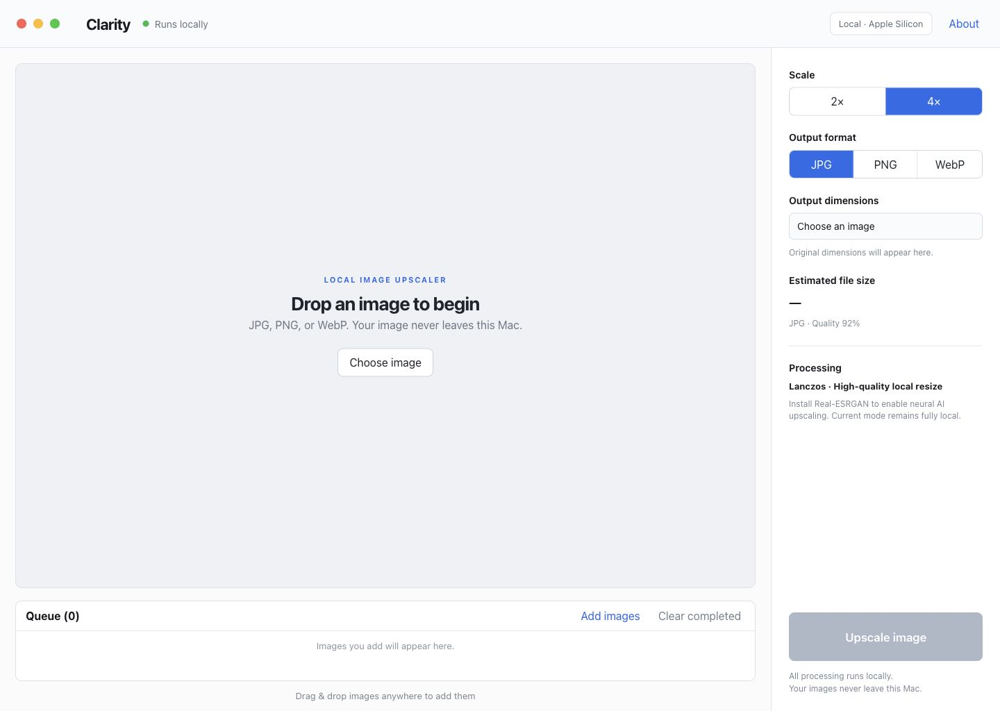

# Clarity

A private, local-first AI image upscaler for macOS. Clarity uses Real-ESRGAN
on Apple Silicon and keeps every image on your Mac.



## Features

- Real-ESRGAN neural photo upscaling with the `realesrgan-x4plus` model
- 2x and 4x scale options
- JPG, PNG, and WebP output
- Drag-and-drop batch queue
- Before/after comparison
- Fully local processing with no uploads or telemetry
- High-quality Lanczos fallback if the AI runtime is unavailable

## Quick Start

### Easiest

Double-click `run.command`.

### Terminal

```bash
python3 -m pip install -r requirements.txt
python3 server.py
```

Open [http://127.0.0.1:4173](http://127.0.0.1:4173).

## Requirements

- macOS on Apple Silicon or Intel
- Python 3.9+
- Pillow

The repository includes the official universal macOS Real-ESRGAN portable
runtime and photo model. No PyTorch, CUDA, account, or API key is required.

## Privacy

Clarity binds only to `127.0.0.1`. Images are processed in temporary local
directories and returned directly to the browser. The app does not upload
images, use telemetry, or call a cloud service.

## Documentation

- [Architecture](docs/ARCHITECTURE.md)
- [Development](docs/DEVELOPMENT.md)
- [Publishing to GitHub](docs/PUBLISHING.md)
- [Contributing](CONTRIBUTING.md)
- [Security](SECURITY.md)
- [Third-party notices](THIRD_PARTY_NOTICES.md)

## License

Original Clarity code and documentation are available under the
[MIT License](LICENSE). The bundled Real-ESRGAN runtime and model are subject
to their upstream licenses; see [Third-Party Notices](THIRD_PARTY_NOTICES.md).
